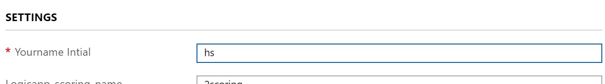

# 0. Create Lab Environment

> Provisioning will take less then 5 mins

## 0.1 Login Azure Portal

Open your browser and go to [Azure Portal](https://portal.azure.com)

## 0.2 Create Resources

Your will deploy Azure resources in a resource group or existing resorce group

### Deploy Azure resources using template

Pleaes press _Ctrl_ and click following link

Or open the link in a new tab

__[Deploy Resources from Azure Portal](https://portal.azure.com/#create/Microsoft.Template/uri/https%3A%2F%2Fraw.githubusercontent.com%2Fxlegend1024%2Fazlab-text-analysis%2Fmaster%2F0.EnvironmentSetting%2Fazlab_template.json)__

You will see _Custom deployment_ in Azure portal

Select your exsiting resource groupp name _OR_ Create new Resource group

Type your name initial for example, hs

> Maximum length is 2

Click _Purchase_ to continue

## 0.3 Review the environment

Once you successfully deploy the resources you will see following resources in your resource group.

* Logic App * 2
* Event Hub Namespace and EventHub
* Blob Storage
* Azure Databricks
* Azure Machine Learning
* Cosmos DB

---

[Next](https://github.com/xlegend1024/azlab-text-analysis/blob/master/1.LogicApp/README.md)
