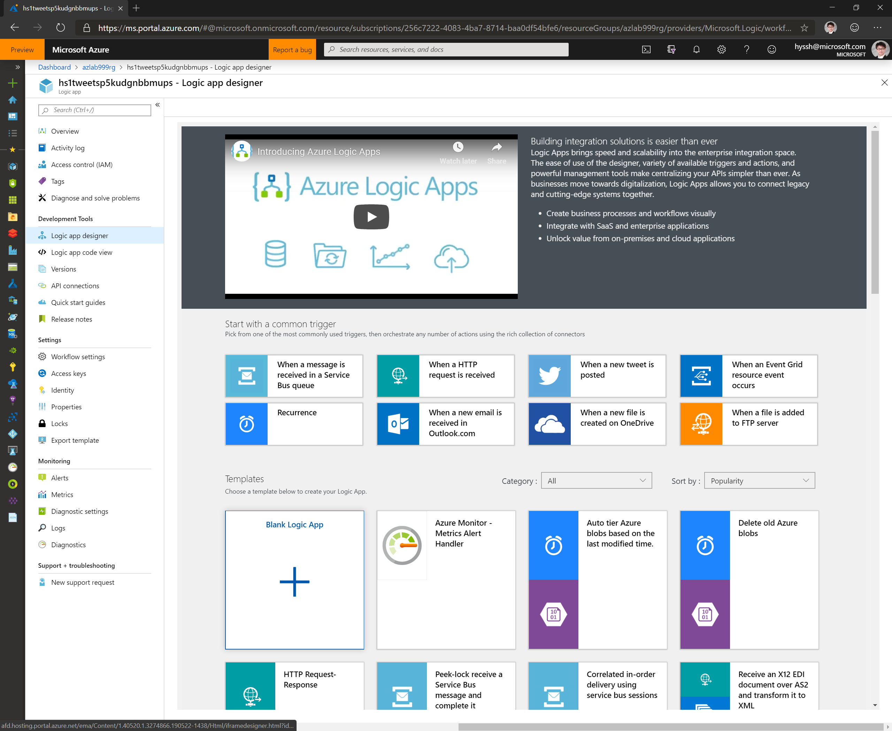
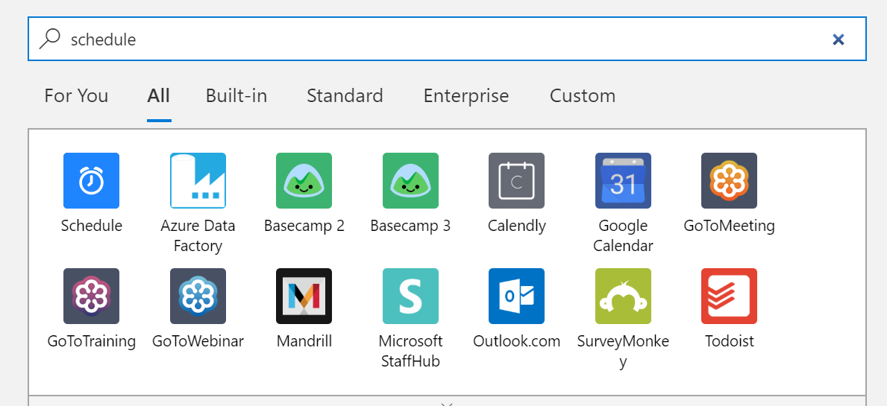
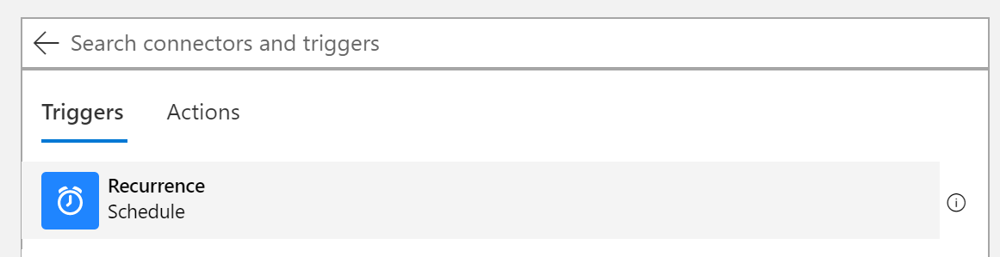
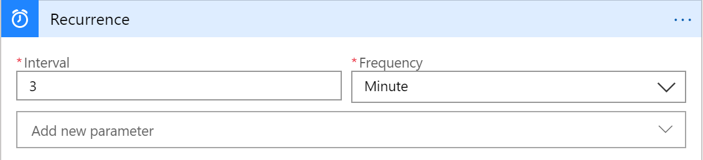
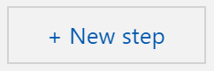
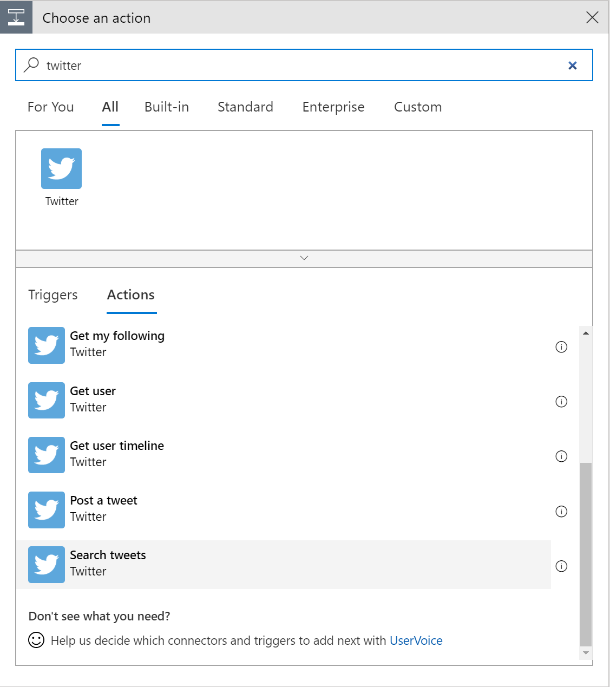
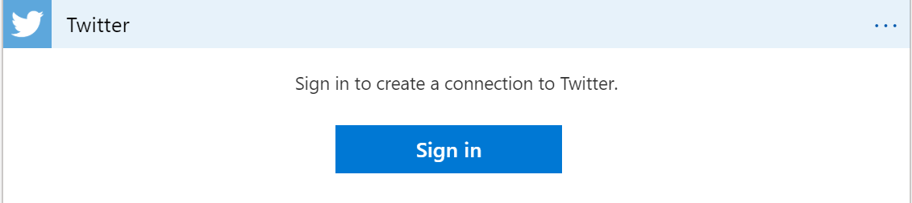
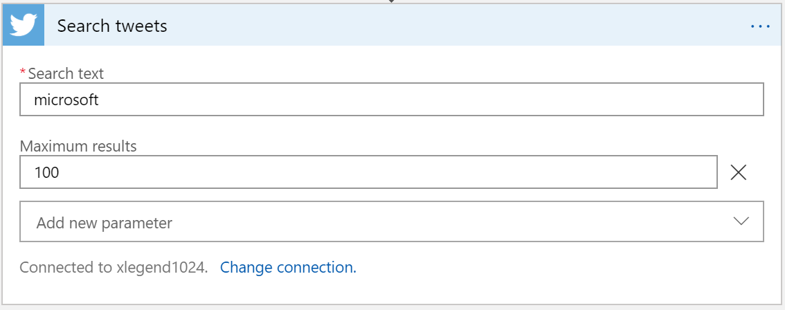
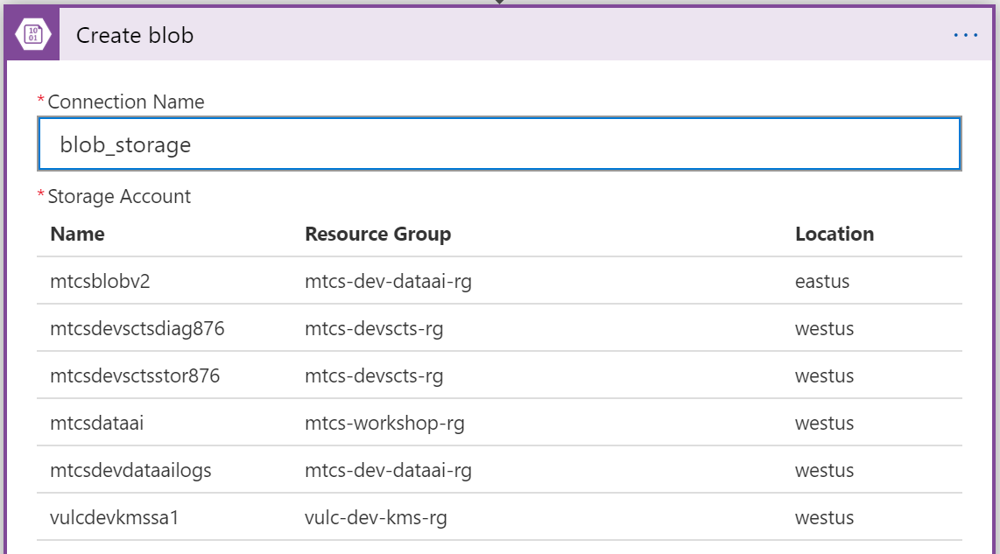
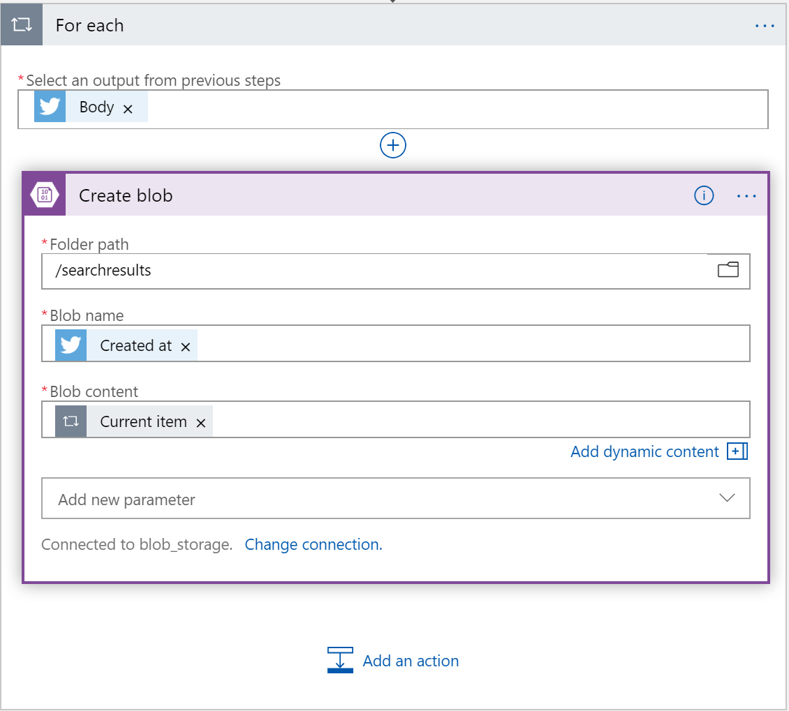

# 1. Inget Data

Design a logic to collect tweets

## 1.1 Open Logic App Design

Go to your logic app that contains name '\*tweets\*'

Open _Logic App Designer_ in _'Development Tools'_ section

Click _'Blank Logic App'_ from _Templates_

## 1.2 Design Trigger

### 1.2.1 Set Scheduleer 

Search 'schedule' from the search bar and select the schedule icon from the result

Select _'Recurrence'_ 

you'll see the module on your screen

Click '+ New Step' to continue to build logic

### 1.2.2 Search Tweets 

Search _twitter_ from the search box and select _'Search tweets'_ in Actions

Sign in with your twitter account and authorize 

type keywords to search from Twitter

Click _'Create'_ button at buttom 

