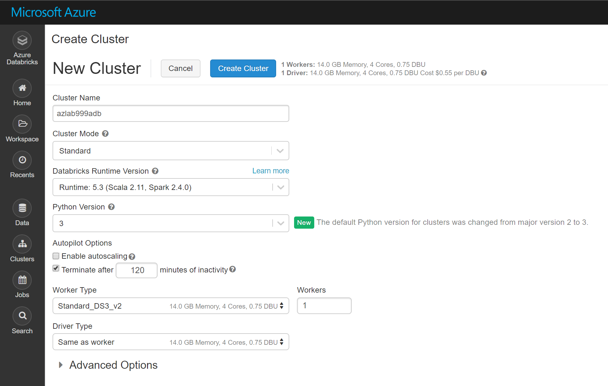
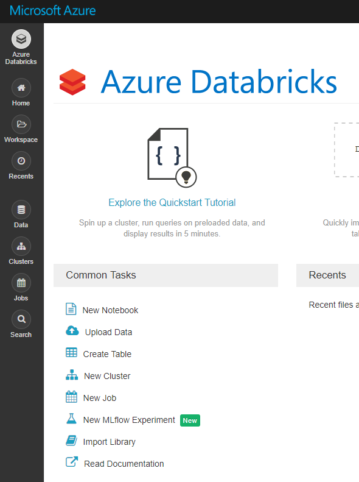
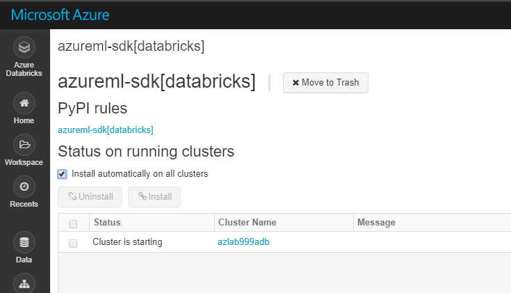
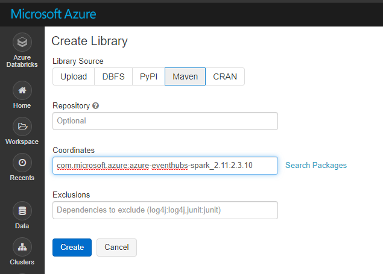
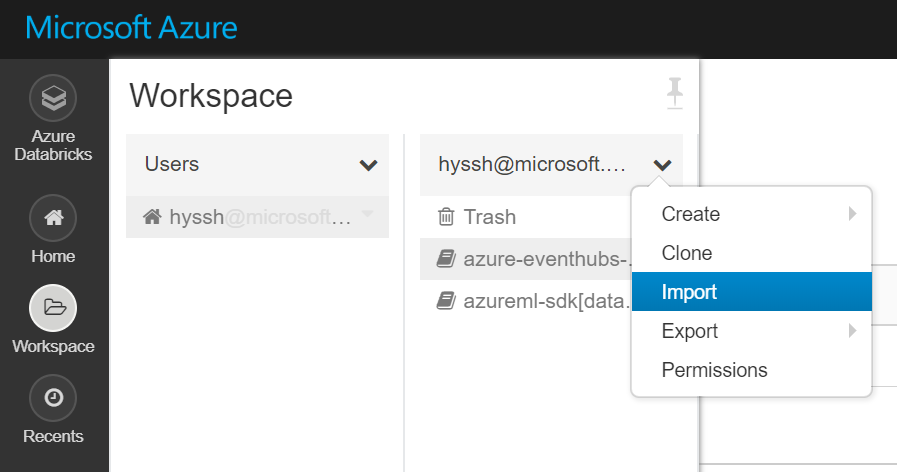

# 2. Build a Model

## Create Cluster



## Import Libraries

Go to 'Azure Databricks' page by clicking left top conner icon




From PyPi
```
azureml-sdk[databricks]
```


Please click _Confirm_ button to install library to all clusters in Azure Databricsk workspace




From Maven
```
com.microsoft.azure:azure-eventhubs-spark_2.11:2.3.10
```


## Import Notebooks

