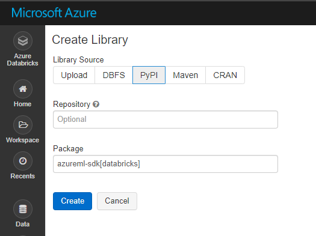

# 2. Data Analysis in scale

## Create Cluster


## Import Libraries

Go to 'Azure Databricks' page by clicking left top conner icon

And click 'Import Library' icon


Import Azure Machine Learning SDK to your Databricks cluster

From PyPi
```
azureml-sdk[databricks]
```



Please click _Confirm_ button to install library to all clusters in Azure Databricsk workspace


## Import Notebooks

And import databricks archive from following URL

```text
https://github.com/xlegend1024/azlab-text-analysis/blob/master/2.ADB/Sentiment-Analysis.dbc
```


---

[Next > 2.1 Understand Data](https://github.com/xlegend1024/azlab-text-analysis/blob/master/2.ADB/UnderstandData.md)