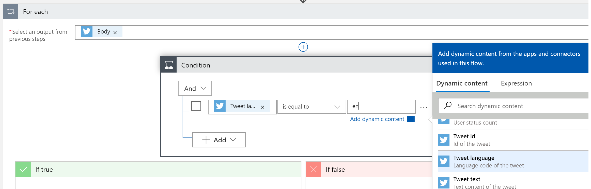

# Real-time scoring 


Parse Json 1
```json
{
    "type": "object",
    "properties": {
        "TweetText": {
            "type": "string"
        },
        "TweetId": {
            "type": "string"
        },
        "CreatedAt": {
            "type": "string"
        },
        "CreatedAtIso": {
            "type": "string"
        },
        "RetweetCount": {
            "type": "integer"
        },
        "TweetedBy": {
            "type": "string"
        },
        "MediaUrls": {
            "type": "array"
        },
        "TweetLanguageCode": {
            "type": "string"
        },
        "TweetInReplyToUserId": {
            "type": "string"
        },
        "Favorited": {
            "type": "boolean"
        },
        "UserMentions": {
            "type": "array",
            "items": {
                "type": "object",
                "properties": {
                    "Id": {
                        "type": "integer"
                    },
                    "FullName": {
                        "type": "string"
                    },
                    "UserName": {
                        "type": "string"
                    }
                },
                "required": [
                    "Id",
                    "FullName",
                    "UserName"
                ]
            }
        },
        "OriginalTweet": {},
        "UserDetails": {
            "type": "object",
            "properties": {
                "FullName": {
                    "type": "string"
                },
                "Location": {
                    "type": "string"
                },
                "Id": {
                    "type": "integer"
                },
                "UserName": {
                    "type": "string"
                },
                "FollowersCount": {
                    "type": "integer"
                },
                "Description": {
                    "type": "string"
                },
                "StatusesCount": {
                    "type": "integer"
                },
                "FriendsCount": {
                    "type": "integer"
                },
                "FavouritesCount": {
                    "type": "integer"
                },
                "ProfileImageUrl": {
                    "type": "string"
                }
            }
        }
    }
}
```



Compose 

```json 
[
  {
    "id": "",
    "text": ""
  }
]
```


Parse Json 3

```json 
{
    "properties": {
        "id": {
            "type": "string"
        },
        "prediction": {
            "maximum": 1,
            "minimum": 0,
            "type": "number"
        },
        "text": {
            "type": "string"
        }
    },
    "type": "object"
}
```

Parse Json 4
```json
{
    "properties": {
        "body": {
            "properties": {
                "CreatedAt": {
                    "type": "string"
                },
                "CreatedAtIso": {
                    "type": "string"
                },
                "Favorited": {
                    "type": "boolean"
                },
                "MediaUrls": {
                    "type": "array"
                },
                "OriginalTweet": {},
                "RetweetCount": {
                    "type": "integer"
                },
                "TweetId": {
                    "type": "string"
                },
                "TweetInReplyToUserId": {
                    "type": "string"
                },
                "TweetLanguageCode": {
                    "type": "string"
                },
                "TweetText": {
                    "type": "string"
                },
                "TweetedBy": {
                    "type": "string"
                },
                "UserDetails": {
                    "properties": {
                        "Description": {
                            "type": "string"
                        },
                        "FavouritesCount": {
                            "type": "integer"
                        },
                        "FollowersCount": {
                            "type": "integer"
                        },
                        "FriendsCount": {
                            "type": "integer"
                        },
                        "FullName": {
                            "type": "string"
                        },
                        "Id": {
                            "type": "integer"
                        },
                        "Location": {
                            "type": "string"
                        },
                        "ProfileImageUrl": {
                            "type": "string"
                        },
                        "StatusesCount": {
                            "type": "integer"
                        },
                        "UserName": {
                            "type": "string"
                        }
                    },
                    "type": "object"
                },
                "UserMentions": {
                    "items": {
                        "properties": {
                            "FullName": {
                                "type": "string"
                            },
                            "Id": {
                                "type": "integer"
                            },
                            "UserName": {
                                "type": "string"
                            }
                        },
                        "required": [
                            "Id",
                            "FullName",
                            "UserName"
                        ],
                        "type": "object"
                    },
                    "type": "array"
                }
            },
            "type": "object"
        },
        "id": {
            "type": "string"
        },
        "prediction": {
            "type": "number"
        },
        "tweetid": {
            "type": "string"
        }
    },
    "type": "object"
}
```