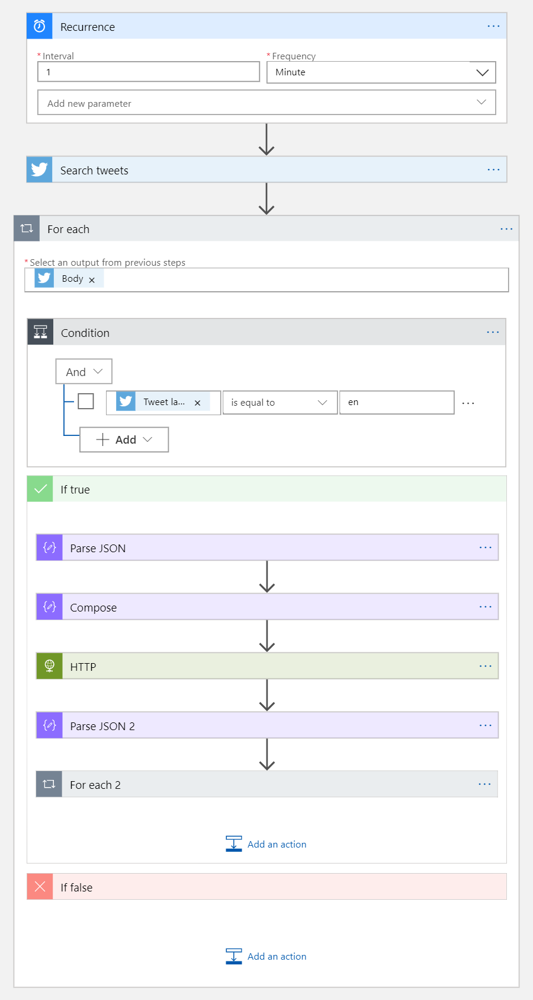

# 4. Real-time scoring

Create logic to get real-time prediction

## 4.1 Flow overview

This logic app consist with three parts Recurrence, Search tweets and For each modules.

The last For each module consist with multiple modules. 



### 4.1.1 Recurrence

* Add Recurrence module and configure it like following


### 4.1.2 Search Tweets

* Add Twitter Search and type key word to search 


### 4.1.3 For each

* Add For each module as the next action
* Select Twitter body

#### 4.1.3.1 For each > Condition

* Add Condition action fron Control module


* Select TweetLanguageCode for the condition and type ```en``` for the value


#### 4.1.3.2 For each > Condition > True

Click _'Add an action'_ inside True

> We will leave False empty

#### 4.1.3.3 For each > Condition > Ture > Parse JSON

|parameter name|value|
|---|---|
|content|```@{items('For_each')}```|

Copy following json schema

```json
{
    "properties": {
        "CreatedAt": {
            "type": "string"
        },
        "CreatedAtIso": {
            "type": "string"
        },
        "Favorited": {
            "type": "boolean"
        },
        "MediaUrls": {
            "type": "array"
        },
        "OriginalTweet": {},
        "RetweetCount": {
            "type": "integer"
        },
        "TweetId": {
            "type": "string"
        },
        "TweetInReplyToUserId": {
            "type": "string"
        },
        "TweetLanguageCode": {
            "type": "string"
        },
        "TweetText": {
            "type": "string"
        },
        "TweetedBy": {
            "type": "string"
        },
        "UserDetails": {},
        "UserMentions": {}
    },
    "type": "object"
}
```


#### 4.1.3.4 For each > Condition > Ture > Compose

Copy next JSON text to _Input_ parameter

```json
[
  {
    "id": "@{body('Parse_JSON')?['TweetId']}",
    "text": "@{replace(string(body('Parse_JSON')?['TweetText']), '\"', '')}"
  }
]
```


#### 4.1.3.5 For each > Condition > Ture > HTTP

Add HTTP module

|parameter name|value|
|---|---|
|Method|POST|
|URI|Copy from Azure Databricks Notebook 4, cell 34th, scoring_uri|
|Headers|```Authorization```|
|Headers|```Content-Type```|
|Headers-Authorization|```Bearer``` Copy from Azure Databricks Notebook 4, cell 34th, api_key|
|Headers-Content-Type|```application/json```|
|Body|```@base64(outputs('Compose'))```|


#### 4.1.3.6 For each > Condition > Ture > Parse JSON 2

* Add Parse JSON module

|parameter name|value|
|---|---|
|content|```json(body('HTTP'))```|

```json
{
    "items": {
        "type": "string"
    },
    "type": "array"
}
```


#### 4.1.3.7 For each > Condition > Ture >  _For each 2_

* Add For each module

```json
@body('Parse_JSON_2')
```


#### 4.1.3.8 For each > Condition > Ture >  For each 2 > _Parse JSON 3_

* Add Parse JSON module

|parameter name|value|
|---|---|
|content|```@{items('For_each')}```|

* And then copy and pate following JSON schema to logic app

```json
{
    "properties": {
        "id": {
            "type": "string"
        },
        "prediction": {
            "maximum": 1,
            "minimum": 0,
            "type": "number"
        },
        "text": {
            "type": "string"
        }
    },
    "type": "object"
}
```


#### 4.1.3.9 For each > Condition > Ture >  For each 2 > _Compose 2_

* Add Compose module and, copy and paste following JSON to the module

```json
{
  "body": @{items('For_each')},
  "id": @{guid()},
  "prediction": @{float(body('Parse_JSON_3')?['prediction'])},
  "tweetid": "@{body('Parse_JSON_3')?['id']}"
}
```


#### 4.1.3.10 For each > Condition > Ture >  For each 2 > _Parse JSON 4_

* Add Parse JSON module and, copy and past following JSON to the module

```json
{
    "properties": {
        "body": {
            "properties": {},
            "type": "object"
        },
        "id": {
            "type": "string"
        },
        "prediction": {
            "type": "number"
        },
        "tweetid": {
            "type": "string"
        }
    },
    "type": "object"
}
```

#### 4.1.3.11 For each > Condition > Ture >  For each 2 > _Create or Update document_

* Add Create or Update document from CosmosDB module


* Add Parition Key value parameter

|parameter name|value|
|---|---|
|Database ID|socialmedia|
|Collection ID|twitter|
|Document|```@{outputs('Compose_2')}```|
|Parition key value|```"@{body('Parse_JSON_4')?['id']}"```|

