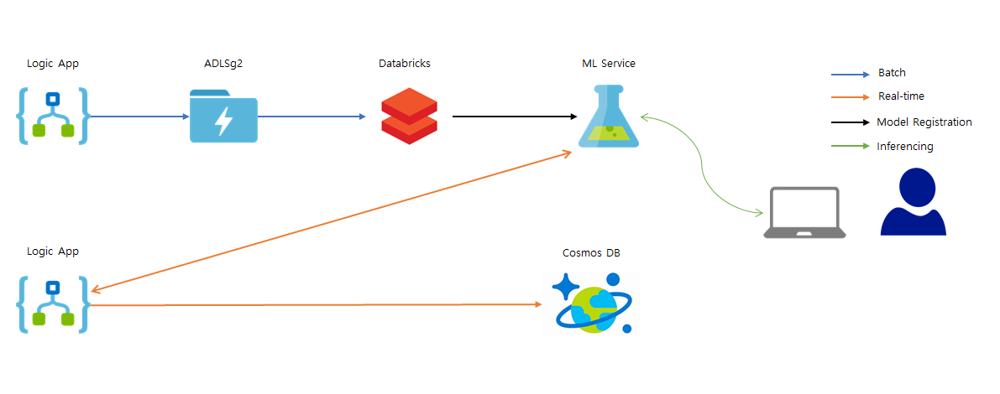

# azlab-text-analysis

## Architecture

## Scenario

## Prerequisite

1. Twitter Account

> Optional) _* Enable Twitter Developer [link](https://developer.twitter.com/)_

1. Azure Account and Subsciprtion

* Have contributor role of a subscription or a resource group

## Labs

### [0. Create Lab Environment](https://github.com/xlegend1024/azlab-text-analysis/tree/master/0.EnvironmentSetting)

Create

### [1. Logic App](https://github.com/xlegend1024/azlab-text-analysis/tree/master/1.LogicApp)

### [2. Azure Databricks](https://github.com/xlegend1024/azlab-text-analysis/tree/master/2.ADB)

### [3. Azure Machine Learning](https://github.com/xlegend1024/azlab-text-analysis/tree/master/3.AML)

### [4. Logic App](https://github.com/xlegend1024/azlab-text-analysis/tree/master/4.LogicApp)

### Delete Resource Group